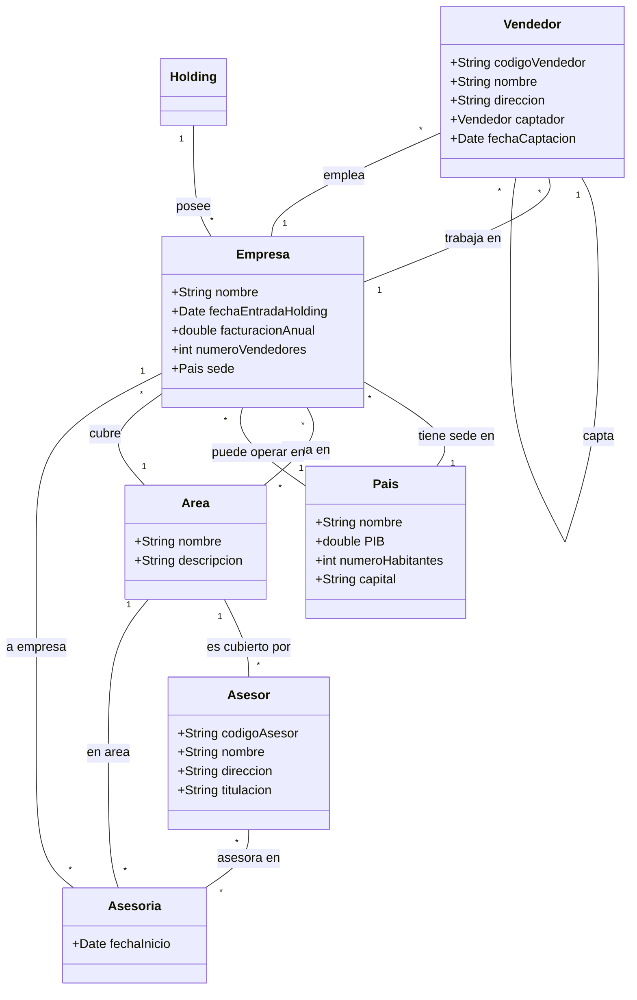

```mermaid
classDiagram
    class Vendedor {
        +String codigoVendedor
        +String nombre
        +String direccion
        +Vendedor captador
        +Date fechaCaptacion
    }

    class Empresa {
        +String nombre
        +Date fechaEntradaHolding
        +double facturacionAnual
        +int numeroVendedores
        +Pais sede
    }
    
    class Pais {
        +String nombre
        +double PIB
        +int numeroHabitantes
        +String capital
    }
    
    class Area {
        +String nombre
        +String descripcion
    }
        
    class Asesor {
        +String codigoAsesor
        +String nombre
        +String direccion
        +String titulacion
    }
    
    class Asesoria {
        +Date fechaInicio
    }
    
    Holding "1" -- "*" Empresa : posee
    Empresa "1" -- "*" Vendedor : emplea
    Empresa "*" -- "1" Pais : tiene sede en
    Empresa "*" -- "*" Area : actua en
    Pais "1" -- "*" Empresa : puede operar en
    Area "1" -- "*" Empresa : cubre
    Area "1" -- "*" Asesor : es cubierto por
    Asesor "*" -- "*" Asesoria : asesora en
    Asesoria "*" -- "1" Empresa : a empresa
    Asesoria "*" -- "1" Area : en area
    Vendedor "1" -- "*" Vendedor : capta
    Vendedor "*" -- "1" Empresa : trabaja en
```