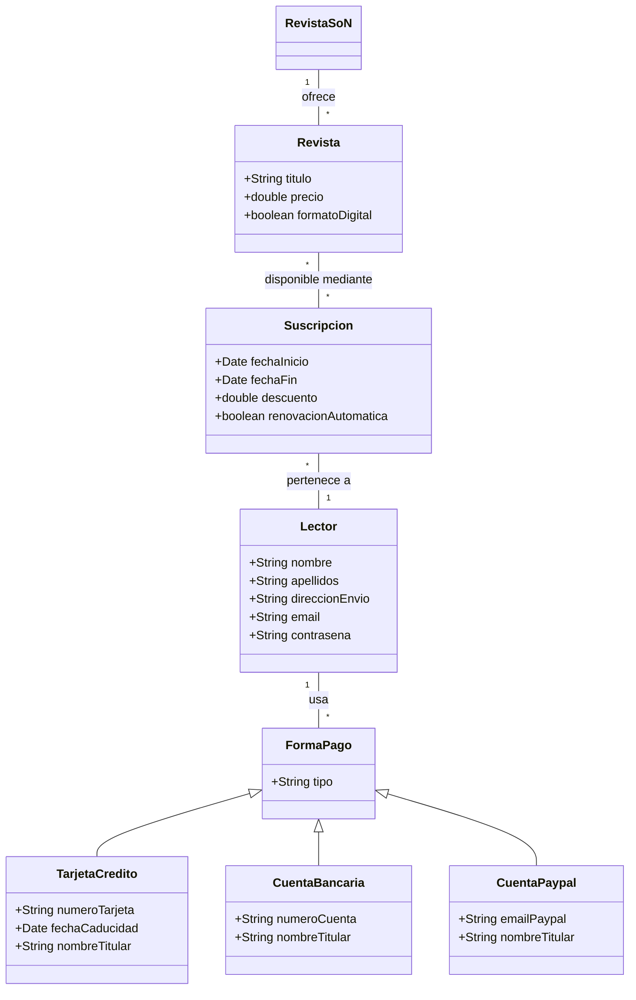

```mermaid
classDiagram
    class RevistaSoN {
    }

    class Revista {
        +String titulo
        +double precio
        +boolean formatoDigital
    }
    
    class Suscripcion {
        +Date fechaInicio
        +Date fechaFin
        +double descuento
        +boolean renovacionAutomatica
    }
    
    class Lector {
        +String nombre
        +String apellidos
        +String direccionEnvio
        +String email
        +String contrasena
    }
    
    class FormaPago {
        +String tipo
    }
    
    class TarjetaCredito {
        +String numeroTarjeta
        +Date fechaCaducidad
        +String nombreTitular
    }
    
    class CuentaBancaria {
        +String numeroCuenta
        +String nombreTitular
    }
    
    class CuentaPaypal {
        +String emailPaypal
        +String nombreTitular
    }
    
    RevistaSoN "1" -- "*" Revista : ofrece
    Revista "*" -- "*" Suscripcion : disponible mediante
    Suscripcion "*" -- "1" Lector : pertenece a
    Lector "1" -- "*" FormaPago : usa
    FormaPago <|-- TarjetaCredito
    FormaPago <|-- CuentaBancaria
    FormaPago <|-- CuentaPaypal
```