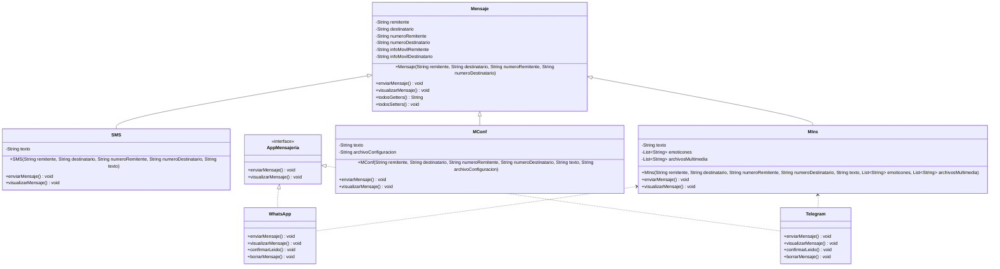

```mermaid
classDiagram
    class Mensaje {
        -String remitente
        -String destinatario
        -String numeroRemitente
        -String numeroDestinatario
        -String infoMovilRemitente
        -String infoMovilDestinatario
        +Mensaje(String remitente, String destinatario, String numeroRemitente, String numeroDestinatario)
        +enviarMensaje() void
        +visualizarMensaje() void
        +todosGetters() String
        +todosSetters() void
    }

    class SMS {
        -String texto
        +SMS(String remitente, String destinatario, String numeroRemitente, String numeroDestinatario, String texto)
        +enviarMensaje() void
        +visualizarMensaje() void
    }

    class MIns {
        -String texto
        -List~String~ emoticones
        -List~String~ archivosMultimedia
        +MIns(String remitente, String destinatario, String numeroRemitente, String numeroDestinatario, String texto, List~String~ emoticones, List~String~ archivosMultimedia)
        +enviarMensaje() void
        +visualizarMensaje() void
    }

    class MConf {
        -String texto
        -String archivoConfiguracion
        +MConf(String remitente, String destinatario, String numeroRemitente, String numeroDestinatario, String texto, String archivoConfiguracion)
        +enviarMensaje() void
        +visualizarMensaje() void
    }

    class AppMensajeria {
        <<interface>>
        +enviarMensaje() void
        +visualizarMensaje() void
    }

    class WhatsApp {
        +enviarMensaje() void
        +visualizarMensaje() void
        +confirmarLeido() void
        +borrarMensaje() void
    }

    class Telegram {
        +enviarMensaje() void
        +visualizarMensaje() void
        +confirmarLeido() void
        +borrarMensaje() void
    }

    Mensaje <|-- SMS
    Mensaje <|-- MIns
    Mensaje <|-- MConf
    AppMensajeria <|.. WhatsApp
    AppMensajeria <|.. Telegram
    MIns <.. WhatsApp
    MIns <.. Telegram

```