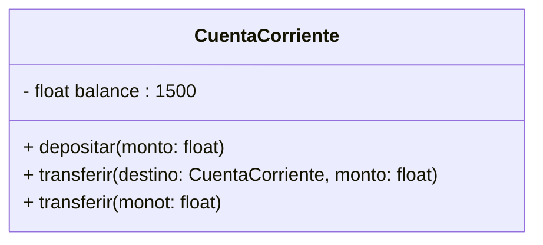
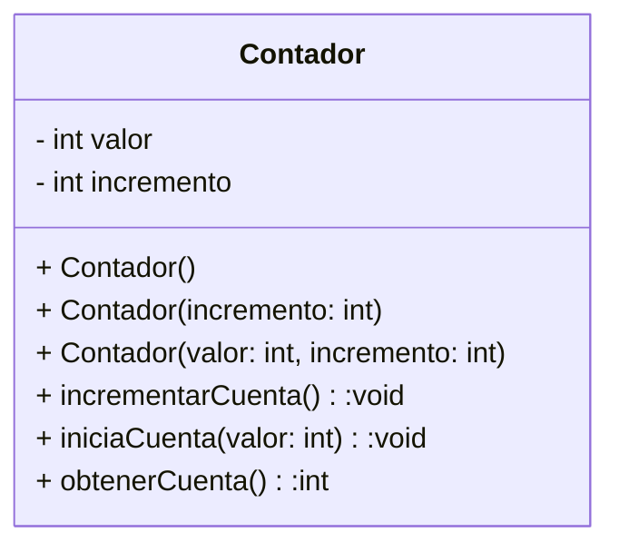

```mermaid
classDiagram
    class CuentaCorriente{
        - float balance : 1500
        + depositar (monto: float)
        + transferir(destino: CuentaCorriente, monto: float)
        + transferir(monot: float)
    }
```

```mermaid
classDiagram
    class Contador{
        - int valor
        - int incremento
        + Contador()
        + Contador(incremento: int) 
        + Contador(valor: int, incremento: int)
        + incrementarCuenta() :void
        + iniciaCuenta(valor: int) :void
        + obtenerCuenta() :int
    }
```